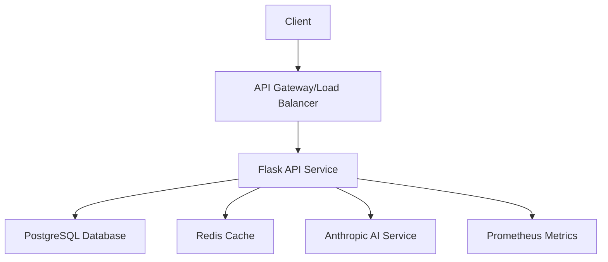
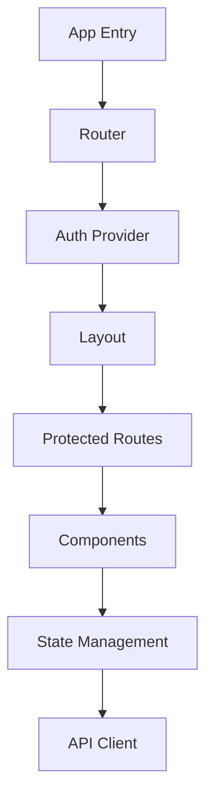

# Grant Application Dashboard - Project Blueprint

## Project Goal: The North Star

The ultimate goal is to build an intelligent grant management co-pilot that dramatically reduces the time and mental load required for non-profits, researchers, and creators to find and win funding.

This isn't just a database of grants - it's an active workflow tool that automates the most painful parts of the grant-seeking process:

- **Discovery**: Sifting through hundreds of irrelevant opportunities
- **Vetting**: Reading dozens of pages of guidelines just to see if you're eligible
- **Management**: Juggling deadlines, tasks, and documents across multiple applications
- **Writing**: Answering the same repetitive questions over and over again

Success means your user feels like they have a super-powered assistant who finds the best grants, tells them if they're a good fit, organizes their work, and helps them write the application. The core metrics of success are "time saved per application" and "increased application quality."

## Strategic Blueprint

### I. The Foundation (Architecture)

#### Frontend
- Framework: React (built with Vite) & TypeScript
- Styling: Tailwind CSS for modern, utility-first design
- Hosting: Vercel (for seamless deployment from GitHub)

#### Backend & Data
- Platform: Supabase
- Database: PostgreSQL (for structured, reliable data)
- Authentication: Supabase Auth
- API: Supabase PostgREST API

#### AI & Intelligence
- Core Engine: LLM API (OpenAI/Claude for quality, Groq for speed)
- Integration: Frontend for MVP, later Supabase Edge Functions

#### Data Ingestion
- Method: Python scripts (BeautifulSoup + requests)
- Database Client: supabase-py for direct production DB writes

### II. Development Phases

#### Phase 1: Core Data & Viewing Layer (Read-Only MVP)
**Objective**: Establish grant database and display interface

Key Deliverables:
- Supabase setup with schema definitions
- Grant data scraper implementation
- Frontend with GrantList and GrantDetail components
- Continuous deployment via Vercel

#### Phase 2: Intelligence & Interaction Layer
**Objective**: Implement smart features and user interactions

Key Deliverables:
- User authentication and profiles
- Smart eligibility scanner
- AI-powered grant analysis
- Persistent analysis storage

#### Phase 3: Workflow & Automation Layer
**Objective**: Transform into project management co-pilot

Key Deliverables:
- Grant status tracking
- AI writing assistant
- Document management system
- Application workflow automation

#### Future Extensions
- Automated scraping via Edge Functions
- Team collaboration features
- Advanced analytics and reporting
- Multi-team support

## System Architecture

### 1. Backend Services


#### Components:
- **API Service** (Flask)
  - Authentication & Authorization
  - Grant Management
  - AI Integration
  - Caching Layer
  - Monitoring

- **Database** (PostgreSQL)
  - User Management
  - Grant Data
  - Organization Profiles
  - Application History

- **Cache** (Redis)
  - Session Management
  - Rate Limiting
  - Data Caching
  - Job Queue

- **External Services**
  - Anthropic Claude API
  - Monitoring (Prometheus/Grafana)
  - Error Tracking (Sentry)

### 2. Frontend Architecture


#### Components:
- **Core**
  - React + TypeScript
  - Material-UI Components
  - Responsive Design
  - Theme System

- **State Management**
  - Zustand Stores
  - React Query
  - Local Storage

- **Features**
  - Authentication Flow
  - Grant Management
  - Analytics Dashboard
  - User Settings

## Database Schema

### Users
```sql
CREATE TABLE users (
    id SERIAL PRIMARY KEY,
    email VARCHAR(255) UNIQUE NOT NULL,
    password_hash VARCHAR(255) NOT NULL,
    first_name VARCHAR(100),
    last_name VARCHAR(100),
    roles JSONB DEFAULT '[]',
    is_active BOOLEAN DEFAULT true,
    created_at TIMESTAMP DEFAULT CURRENT_TIMESTAMP,
    updated_at TIMESTAMP DEFAULT CURRENT_TIMESTAMP,
    last_login TIMESTAMP
);
```

### Grants
```sql
CREATE TABLE grants (
    id SERIAL PRIMARY KEY,
    name VARCHAR(255) NOT NULL,
    funder VARCHAR(255) NOT NULL,
    source_url TEXT,
    due_date TIMESTAMP,
    amount_string VARCHAR(100),
    description TEXT,
    status VARCHAR(50),
    eligibility_analysis JSONB,
    created_at TIMESTAMP DEFAULT CURRENT_TIMESTAMP,
    updated_at TIMESTAMP DEFAULT CURRENT_TIMESTAMP
);
```

### Organization Profiles
```sql
CREATE TABLE organisation_profiles (
    id SERIAL PRIMARY KEY,
    name VARCHAR(255) NOT NULL,
    description TEXT,
    mission TEXT,
    vision TEXT,
    registration_number VARCHAR(100),
    registration_date DATE,
    annual_income DECIMAL(15,2),
    staff_count INTEGER,
    volunteer_count INTEGER,
    focus_areas JSONB,
    target_beneficiaries JSONB,
    created_at TIMESTAMP DEFAULT CURRENT_TIMESTAMP,
    updated_at TIMESTAMP DEFAULT CURRENT_TIMESTAMP
);
```

## API Endpoints

### Authentication
- POST `/api/auth/register`
- POST `/api/auth/login`
- POST `/api/auth/logout`
- GET `/api/auth/me`
- POST `/api/auth/change-password`

### Grants
- GET `/api/grants`
- GET `/api/grants/<id>`
- POST `/api/grants`
- PUT `/api/grants/<id>`
- DELETE `/api/grants/<id>`
- POST `/api/grants/<id>/analyze-eligibility`
- POST `/api/grants/<id>/generate-draft`

### Organizations
- GET `/api/organizations`
- GET `/api/organizations/<id>`
- POST `/api/organizations`
- PUT `/api/organizations/<id>`

## Development Roadmap

### Phase 1: Foundation (Week 1-2)
- [x] Project Setup
- [x] Basic Authentication
- [x] Database Models
- [x] API Structure
- [x] Frontend Setup

### Phase 2: Core Features (Week 3-4)
- [ ] Grant Management CRUD
- [ ] Organization Profiles
- [ ] User Dashboard
- [ ] Basic Search & Filtering
- [ ] Initial UI Components

### Phase 3: AI Integration (Week 5-6)
- [ ] Eligibility Analysis
- [ ] Draft Generation
- [ ] Context Management
- [ ] AI Response Caching
- [ ] Error Handling

### Phase 4: Advanced Features (Week 7-8)
- [ ] Advanced Search
- [ ] Analytics Dashboard
- [ ] Batch Operations
- [ ] Export Features
- [ ] Email Notifications

### Phase 5: Polish & Performance (Week 9-10)
- [ ] Performance Optimization
- [ ] Enhanced Caching
- [ ] UI/UX Improvements
- [ ] Documentation
- [ ] Testing Coverage

## Testing Strategy

### Backend Tests
- Unit Tests (pytest)
- Integration Tests
- API Tests
- Cache Tests
- AI Integration Tests

### Frontend Tests
- Component Tests (Vitest)
- Integration Tests
- E2E Tests
- State Management Tests
- API Client Tests

## Monitoring & Analytics

### Metrics
- Request Latency
- Error Rates
- Cache Hit/Miss Rates
- AI Response Times
- User Activity

### Logging
- Application Logs
- Error Logs
- Audit Logs
- Performance Logs

## Security Measures

### Authentication
- JWT Token Management
- Password Hashing
- Session Management
- Rate Limiting

### Data Protection
- Input Validation
- SQL Injection Prevention
- XSS Protection
- CSRF Protection

### API Security
- Request Validation
- Response Sanitization
- Error Handling
- Security Headers

## Deployment Strategy

### Development
- Local Development
- Testing Environment
- CI/CD Pipeline

### Staging
- Review Apps
- Integration Testing
- Performance Testing

### Production
- Blue-Green Deployment
- Database Migrations
- Cache Warming
- Monitoring Setup

## Documentation

### Technical Documentation
- API Documentation
- Database Schema
- Component Library
- Integration Guides

### User Documentation
- User Guides
- Admin Guides
- API Guides
- FAQs

## Maintenance

### Regular Tasks
- Database Backups
- Log Rotation
- Cache Cleanup
- Security Updates

### Monitoring
- System Health
- Performance Metrics
- Error Tracking
- Usage Analytics 