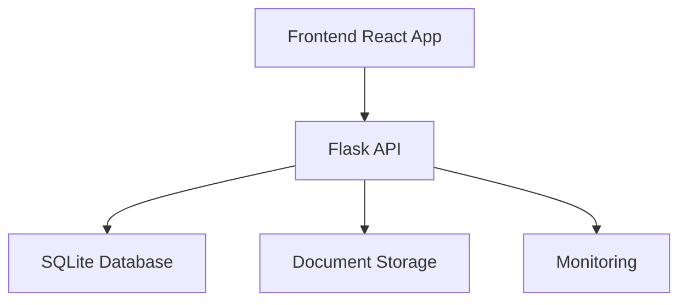

# Project Blueprint

## Overview

This isn't just a database of grants - it's an active workflow tool that helps streamline the grant-seeking process:

- **Discovery**: Finding relevant opportunities
- **Vetting**: Evaluating grant requirements and eligibility
- **Management**: Organizing deadlines, tasks, and documents
- **Writing**: Managing application content and responses

## Tech Stack

### Frontend
- Framework: React with TypeScript
- UI Library: Material-UI
- State Management: Zustand
- Data Fetching: React Query
- Styling: Tailwind CSS for modern, utility-first design
- Build Tool: Vite

### Backend
- Framework: Flask (Python)
- Database: SQLite
- Authentication: JWT
- API Documentation: OpenAPI/Swagger
- Monitoring: Prometheus/Grafana

### Core Features
- User Authentication & Authorization
- Grant Discovery & Management
- Eligibility Assessment
- Document Management
- Team Collaboration
- Progress Tracking
- Deadline Management

## Architecture



## Implementation Plan

### Phase 1: Foundation (Week 1-2)
- [x] Project Setup
- [x] Basic Auth
- [x] Database Schema
- [x] API Structure

### Phase 2: Core Features (Week 3-4)
- [x] Grant Management
- [x] User Dashboard
- [x] Document Upload
- [x] Search & Filter

### Phase 3: Advanced Features (Week 5-6)
- [ ] Team Collaboration
- [ ] Eligibility Rules
- [ ] Response Templates
- [ ] Progress Tracking

### Phase 4: Polish (Week 7-8)
- [ ] UI/UX Improvements
- [ ] Performance Optimization
- [ ] Documentation
- [ ] Testing

## Database Schema

### Users
```sql
CREATE TABLE users (
    id INTEGER PRIMARY KEY,
    email VARCHAR(255) UNIQUE NOT NULL,
    password_hash VARCHAR(255) NOT NULL,
    name VARCHAR(255),
    role VARCHAR(50),
    created_at TIMESTAMP DEFAULT CURRENT_TIMESTAMP
);
```

### Grants
```sql
CREATE TABLE grants (
    id INTEGER PRIMARY KEY,
    name VARCHAR(255) NOT NULL,
    funder VARCHAR(255),
    amount DECIMAL,
    due_date DATE,
    description TEXT,
    eligibility_criteria TEXT,
    status VARCHAR(50),
    created_at TIMESTAMP DEFAULT CURRENT_TIMESTAMP
);
```

### Organizations
```sql
CREATE TABLE organizations (
    id INTEGER PRIMARY KEY,
    name VARCHAR(255) NOT NULL,
    mission TEXT,
    focus_areas TEXT,
    annual_budget DECIMAL,
    staff_size INTEGER,
    created_at TIMESTAMP DEFAULT CURRENT_TIMESTAMP
);
```

## API Endpoints

### Authentication
- POST /api/auth/register
- POST /api/auth/login
- POST /api/auth/refresh
- POST /api/auth/logout

### Grants
- GET /api/grants
- POST /api/grants
- GET /api/grants/{id}
- PUT /api/grants/{id}
- DELETE /api/grants/{id}

### Organizations
- GET /api/organizations
- POST /api/organizations
- GET /api/organizations/{id}
- PUT /api/organizations/{id}

### Users
- GET /api/users/me
- PUT /api/users/me
- GET /api/users/{id}
- PUT /api/users/{id}

## Monitoring Metrics

### Application Metrics
- Request Latency
- Error Rates
- Active Users
- Grant Applications
- Success Rates

### System Metrics
- CPU Usage
- Memory Usage
- Disk I/O
- Network Traffic

## Testing Strategy

### Unit Tests
- API Endpoints
- Database Models
- Utility Functions
- React Components

### Integration Tests
- API Flows
- User Journeys
- Database Operations

### End-to-End Tests
- Critical User Paths
- Authentication Flows
- Grant Application Process

## Maintenance

### Regular Tasks
- Database Backups
- Log Rotation
- Security Updates
- Performance Monitoring

### Monitoring
- Error Tracking
- Performance Metrics
- User Analytics 